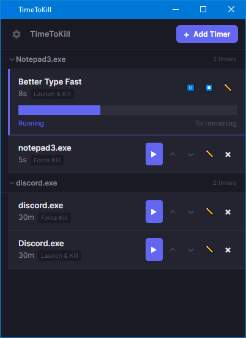

# TTK -> Time To *Kill🗡️*

A Windows desktop app that runs countdown timers against processes. When a timer expires, it takes an action -- kill the process, suspend it, demote its priority, or other options. Useful for automatically ending game sessions, closing distracting apps after a set period, or any situation where you want a process to stop on a schedule.

Built with .NET 10 and [Avalonia UI](https://avaloniaui.net/). Runs in the system tray.



## Features

**Timer actions** -- each timer targets a process by name and runs one of these actions when time is up:

- **Kill** -- terminates the process via `taskkill`
- **Force Kill** -- same, but with `/F` flag
- **Suspend** -- freezes all threads in the process (it stays in memory but stops executing)
- **Demote Priority** -- sets the process to below-normal priority
- **Launch & Kill** -- launches a process when the timer starts, then force-kills it when time expires. Good for "let this run for exactly N minutes" scenarios.

**Other features:**

- Pause, resume, and cancel running timers
- Auto-start on launch -- mark timers to begin counting down automatically when the app opens
- Custom display labels -- name your timers something readable instead of showing raw process names
- Process name flexibility -- enter just a name like `discord.exe` or a full path like `C:\Apps\discord.exe`
- Automatic grouping -- multiple timers targeting the same process are grouped under a collapsible header
- Reorder timers with up/down controls
- Duration presets (30s, 5m, 15m, 30m, 1h, 2h) for quick setup
- System tray icon with status indicator (idle/active/fired) and tooltip showing active timer countdowns
- Minimizes to tray on close -- the app keeps running in the background
- Themes -- six built-in color themes (dark, light, zenburn, monokai, solarized dark, solarized light) selectable from the gear icon

## Usage

1. Click **+ Add Timer** to create a new timer preset.
2. Enter a process name (e.g. `notepad.exe`), set a duration, and pick an action.
3. Click the play button on a timer row to start the countdown.
4. When the timer reaches zero, the action executes. A notification bar at the bottom confirms what happened.

Timers persist across app restarts. Closing the window hides the app to the system tray -- right-click the tray icon or click it to reopen. Use the tray menu "Exit" to actually quit.

## Building

Requires the [.NET 10 SDK](https://dotnet.microsoft.com/download/dotnet/10.0).

**From Visual Studio or Rider:** Open `TimeToKill.sln` and build normally.

**From command line:**

```
dotnet build
```

**Standalone executable:**

Run `build_standalone.bat` to produce a single-file framework-dependent exe in the `publish/` directory:

```
build_standalone.bat
```

This creates a single `.exe` that requires the .NET 10 runtime to be installed on the target machine. It is not self-contained.

## Configuration

Timer presets are stored as JSON at:

```
~/.config/timetokill/presets.json
aka
%USERPROFILE%\.config\timetokill\presets.json
```

You can back this file up or edit it by hand if needed. The format is straightforward -- an array of timer preset objects with fields like `processName`, `duration`, `actionType`, `autoRunOnStart`, and `sortOrder`.

### TODO
* Better Icon
* GLOB/Relocatable paths
* Timer nudge (add/subtract time on the fly)
* More actions (hibernate, custom command, etc)
* Figure out a better joke about TTL, 'time to waste' -> 'ttk'

## License

See [LICENSE](LICENSE) file.
